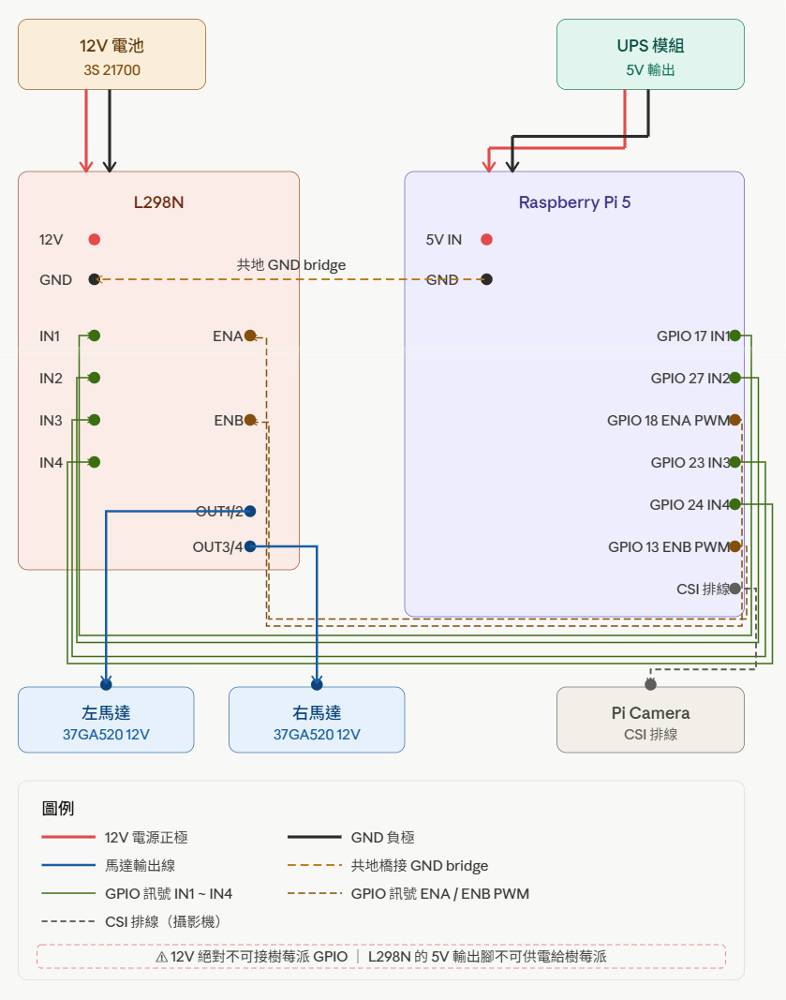

# Robot01 — FPV 網頁遙控機器人

透過手機瀏覽器即時觀看攝影機畫面，並以雙搖桿操控兩顆馬達的履帶式機器人。

---

## 專案架構與檔案說明

```
Robot01/
├── app.py          # Flask 主程式：GPIO 馬達控制 + Socket.IO 事件處理
├── mediamtx        # 攝影機串流執行檔（mediamtx v1.9.x）
├── mediamtx.yml    # mediamtx 設定：解析度、幀率、WebRTC 埠號
├── start.sh        # 一鍵啟動腳本
└── templates/
    └── index.html  # 前端頁面：WebRTC 影像 + 雙搖桿控制介面
```

### 使用的技術與 API

| 技術 | 用途 |
|------|------|
| **Flask** | HTTP 伺服器，提供前端頁面（port 5000） |
| **Flask-SocketIO** | 伺服器端 WebSocket，接收搖桿指令 |
| **lgpio** | 樹莓派 5 的 GPIO 控制函式庫（控制馬達驅動板）|
| **mediamtx** | 將 Pi Camera 轉為 WebRTC 串流（port 8889） |
| **WebRTC WHEP** | 瀏覽器端從 mediamtx 拉取影像串流的協定 |
| **Socket.IO（CDN）** | 瀏覽器端 WebSocket，傳送搖桿數值 |

### GPIO 腳位對應



| 腳位 | BCM 編號 | 功能 |
|------|----------|------|
| L_IN1 | 17 | 左輪方向 A |
| L_IN2 | 27 | 左輪方向 B |
| L_ENA | 18 | 左輪 PWM 速度（硬體 PWM）|
| R_IN3 | 23 | 右輪方向 A |
| R_IN4 | 24 | 右輪方向 B |
| R_ENB | 13 | 右輪 PWM 速度（硬體 PWM）|


---

## 如何開始執行

### 環境需求

- 樹莓派 5（使用 RP1 GPIO 晶片）
- Pi Camera Module（已啟用）
- Python 套件：`flask`、`flask-socketio`、`lgpio`
- 手機與樹莓派需在同一個 Wi-Fi 網路下

### 安裝 Python 套件（首次）

```bash
pip install flask flask-socketio lgpio
```

### 啟動

```bash
cd ~/gemini_workspace/LearningArea/Robot01
./start.sh
```

啟動後終端機會顯示：
```
mediamtx 已啟動 (PID: xxxxx)
```

### 連線

在手機瀏覽器輸入：
```
http://<樹莓派 IP>:5000
```

樹莓派 IP 可用 `hostname -I` 查詢。

---

## 如何操作

| 操作 | 反應 |
|------|------|
| 開啟頁面 | 攝影機畫面自動顯示，上方狀態圓點變為**綠色** |
| 推動**左搖桿**（上/下） | 左輪前進 / 後退 |
| 推動**右搖桿**（上/下） | 右輪前進 / 後退 |
| 雙搖桿同時向上 | 直線前進 |
| 左推上、右推下 | 原地左轉 |
| 放開搖桿 | 搖桿自動回中，馬達停止 |
| 關閉瀏覽器 / 斷線 | 伺服器偵測到斷線，馬達自動緊急停止 |

搖桿數值範圍為 `-100`（全速後退）到 `+100`（全速前進），以 20Hz 頻率送出指令。右輪因安裝方向鏡像，方向訊號在程式內部已自動反相。

---

## 注意事項

- **須手動執行 `./start.sh`**，沒有自動開機啟動，重開機後需重新執行。
- **Socket.IO JS 從 CDN 載入**，手機需要有網路（或同時能連外網的 Wi-Fi）才能正確載入控制功能；若無法連外網，需將 `socket.io.min.js` 改為本地提供。
- **攝影機影像使用 WebRTC**，需瀏覽器支援（Chrome / Safari 現代版本皆支援）。
- **停止服務**：在終端機按 `Ctrl+C`，腳本會自動一併關閉 mediamtx。
- **lgpio 需要 GPIO 存取權限**，若執行時出現 permission denied，嘗試以 `sudo ./start.sh` 啟動。
