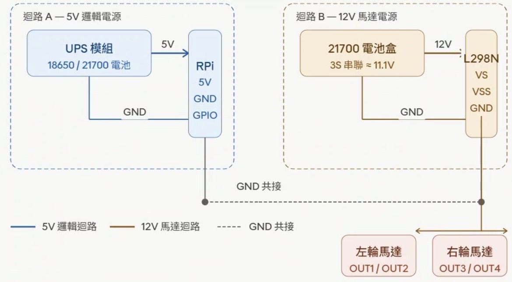
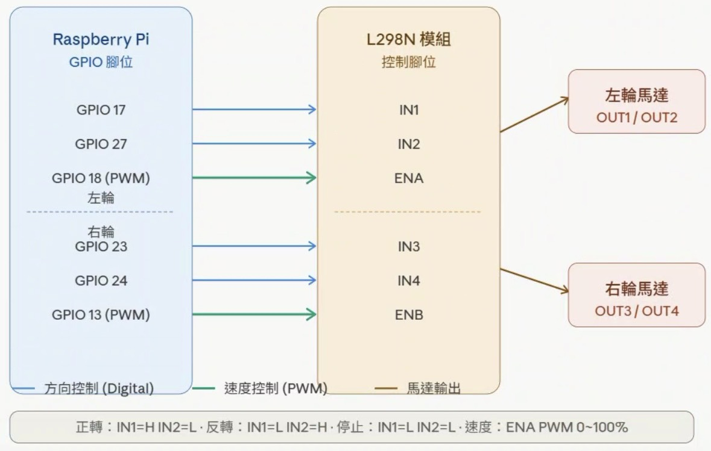

要先在終端機進入虛擬環境 source ~/venv/bin/activate
成功後提示符會變成：
(venv) umesshu@raspberrypi:~ $

接著執行：
python app.py         # 啟動 Flask 伺服器

電源隔離是最核心的安全概念——兩條迴路各自獨立，但 GND 必須共接，這樣樹莓派的 GPIO 輸出訊號才能正確被 L298N 的邏輯端讀取。接下來是 GPIO 控制訊號的接線：

21700 電池盒用 3 顆串聯（3S）約 11.1V，滿電約 12.6V，剛好符合 37GA520 的 12V 額定電壓。UPS 模組和電池盒的 GND 必須用一條線短接，否則 GPIO 的 3.3V 訊號在 L298N 那端沒有參考點，方向控制會失效。

GPIO 腳位選擇

GPIO 18 和 GPIO 13 是樹莓派上支援硬體 PWM 的腳位，建議優先用這兩支接 ENA 和 ENB。硬體 PWM 由晶片內部計時器產生，頻率穩定、不受 Python 程式的執行延遲影響，馬達轉動會更平順。IN1~IN4 用普通 GPIO 即可，只需要輸出高低電位。

VSS 邏輯電源

L298N 上有一個 VSS 腳位（邏輯供電），需要接 5V 或 3.3V。樹莓派 GPIO 輸出是 3.3V，建議把 VSS 接樹莓派的 3.3V Pin（不是 5V），確保邏輯電位相容，避免 L298N 判讀訊號時出現邊緣值模糊的問題。

馬達方向問題

兩顆馬達安裝在機器人左右兩側時，實體方向相反（鏡像安裝），所以「同樣的正轉訊號」實際上一輪往前、一輪往後。這個問題在軟體端處理最簡單：右輪的 IN3/IN4 邏輯在程式裡直接反相，不需要換線。